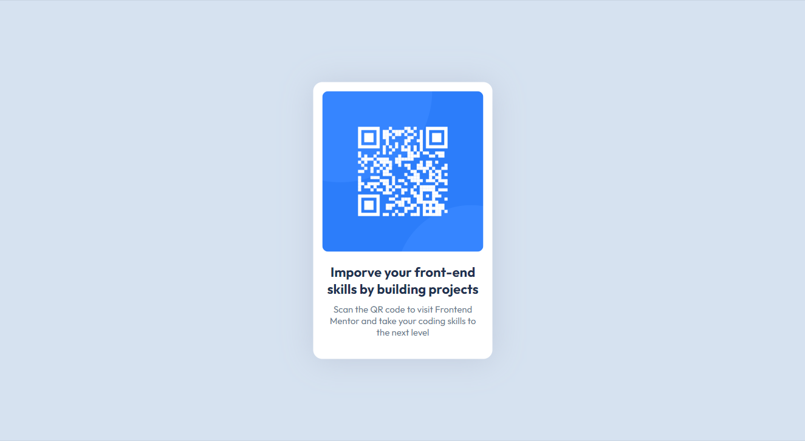

# Frontend Mentor - QR code component solution

This is a solution to the [QR code component challenge on Frontend Mentor](https://www.frontendmentor.io/challenges/qr-code-component-iux_sIO_H). Frontend Mentor challenges help you improve your coding skills by building realistic projects. 

## Overview

### Screenshot

### Links

- Solution URL: [Add solution URL here](https://your-solution-url.com)
- Live Site URL: [Add live site URL here](https://your-live-site-url.com)

## My process

### Built with

- Pue HTML and CSS

## Author

- Website - [Amiolemen Best](https://www.bestolumese.vercel.app)
- Frontend Mentor - [@BestOlumese](https://www.frontendmentor.io/profile/BestOlumese)